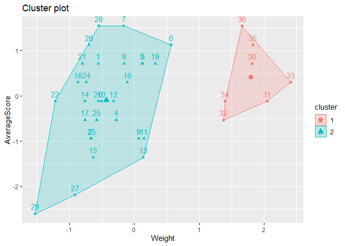
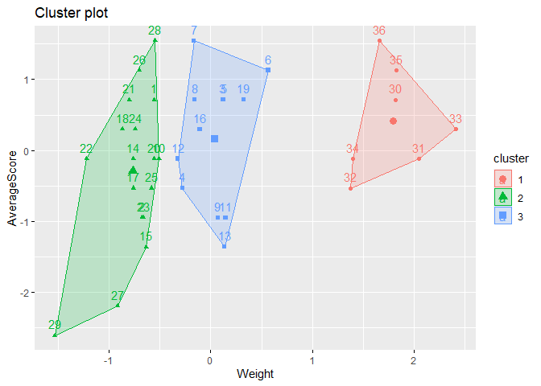
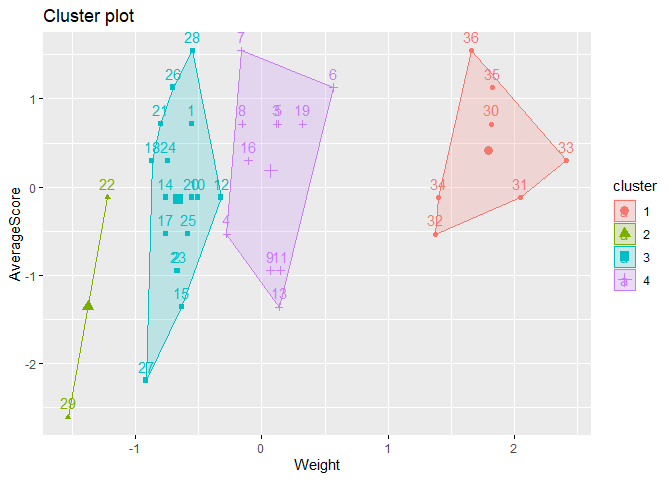
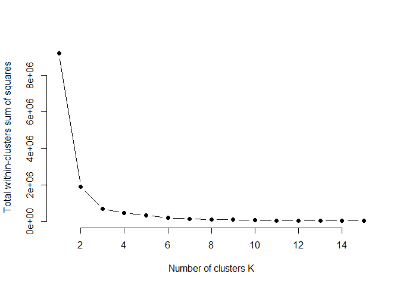

R Notebook for k-means scorings
================

  - [Data extraction, transformation and
    loading](#data-extraction-transformation-and-loading)
      - [Packages loaded](#packages-loaded)
      - [Data loading](#data-loading)
  - [K means](#k-means)
      - [2 means algorithm](#means-algorithm)
      - [2 means visual](#means-visual)
          - [3 means visual](#means-visual-1)
          - [4 means visual](#means-visual-2)
      - [Number of optimal clusters using
        Elbow](#number-of-optimal-clusters-using-elbow)

This is an [R Markdown](http://rmarkdown.rstudio.com) Notebook. When you
execute code within the notebook, the results appear beneath the code.

Try executing this chunk by clicking the *Run* button within the chunk
or by placing your cursor inside it and pressing *Ctrl+Shift+Enter*.

# Data extraction, transformation and loading

## Packages loaded

``` r
r = getOption("repos")
r["CRAN"] = "http://cran.us.r-project.org"
options(repos = r)

#data loading
if (!require("readr")) {
  install.packages("readr", dependencies = TRUE)
  library(readr)
  citation("readr")
}
```

    ## Loading required package: readr

``` r
#data manipulation
if (!require("dplyr")) {
  install.packages("dplyr", dependencies = TRUE)
  library(dplyr)
  citation("dplyr")
}
```

    ## Loading required package: dplyr

    ## 
    ## Attaching package: 'dplyr'

    ## The following objects are masked from 'package:stats':
    ## 
    ##     filter, lag

    ## The following objects are masked from 'package:base':
    ## 
    ##     intersect, setdiff, setequal, union

``` r
#data visualisation
if (!require("ggplot2")) {
  install.packages("ggplot2", dependencies = TRUE)
  library(ggplot2)
  citation("ggplot2")
}
```

    ## Loading required package: ggplot2

``` r
#drop_na
if (!require("tidyr")) {
  install.packages("tidyr", dependencies = TRUE)
  library(tidyr)
  citation("tidyr")
}
```

    ## Loading required package: tidyr

``` r
#map_dbl
if (!require("purrr")) {
  install.packages("purrr", dependencies = TRUE)
  library(purrr)
  citation("purrr")
}
```

    ## Loading required package: purrr

``` r
#map_dbl
if (!require("factoextra")) {
  install.packages("factoextra", dependencies = TRUE)
  library(factoextra)
  citation("factoextra")
}
```

    ## Loading required package: factoextra

    ## Welcome! Related Books: `Practical Guide To Cluster Analysis in R` at https://goo.gl/13EFCZ

## Data loading

``` r
typeVars <- c("Feet", "Head", "Type","FeatherColor")
ScoringData <- 
  read_delim(
    "../Data/Scorings.csv",
    delim = ";",
    col_types = cols(
      Date = col_character(),
      Sex = col_character(),
      AnimalIdentifier = col_character(),
      Weight = col_integer(), 
      Color = col_character(), 
      Feet = col_integer(), 
      Head = col_integer(),
      Type = col_integer(), 
      FeatherColor = col_integer()
      )) %>%
  dplyr::mutate(
    AverageScore = rowMeans(select(., typeVars))
    ) %>% drop_na() %>%
  dplyr::select(
    Weight,
    AverageScore
  )
```

# K means

## 2 means algorithm

``` r
kMeans <- kmeans(ScoringData, centers = 2)
kMeans
```

    ## K-means clustering with 2 clusters of sizes 7, 29
    ## 
    ## Cluster means:
    ##     Weight AverageScore
    ## 1 3662.143     4.321429
    ## 2 2522.828     4.008621
    ## 
    ## Clustering vector:
    ##  [1] 2 2 2 2 2 2 2 2 2 2 2 2 2 2 2 2 2 2 2 2 2 2 2 2 2 2 2 2 2 1 1 1 1 1 1 1
    ## 
    ## Within cluster sum of squares by cluster:
    ## [1]  209544.1 1674553.1
    ##  (between_SS / total_SS =  79.5 %)
    ## 
    ## Available components:
    ## 
    ## [1] "cluster"      "centers"      "totss"        "withinss"     "tot.withinss"
    ## [6] "betweenss"    "size"         "iter"         "ifault"

## 2 means visual

``` r
fviz_cluster(kMeans, data = ScoringData)
```

<!-- -->

### 3 means visual

``` r
kMeans <- kmeans(ScoringData, centers = 3)
kMeans
```

    ## K-means clustering with 3 clusters of sizes 7, 17, 12
    ## 
    ## Cluster means:
    ##     Weight AverageScore
    ## 1 3662.143     4.321429
    ## 2 2352.353     3.897059
    ## 3 2764.333     4.166667
    ## 
    ## Clustering vector:
    ##  [1] 2 2 3 3 3 3 3 3 3 2 3 3 3 2 2 3 2 2 3 2 2 2 2 2 2 2 2 2 2 1 1 1 1 1 1 1
    ## 
    ## Within cluster sum of squares by cluster:
    ## [1] 209544.1 289862.9 190742.1
    ##  (between_SS / total_SS =  92.5 %)
    ## 
    ## Available components:
    ## 
    ## [1] "cluster"      "centers"      "totss"        "withinss"     "tot.withinss"
    ## [6] "betweenss"    "size"         "iter"         "ifault"

``` r
fviz_cluster(kMeans, data = ScoringData)
```

<!-- -->

### 4 means visual

``` r
kMeans <- kmeans(ScoringData, centers = 4)
kMeans
```

    ## K-means clustering with 4 clusters of sizes 7, 2, 16, 11
    ## 
    ## Cluster means:
    ##     Weight AverageScore
    ## 1 3662.143     4.321429
    ## 2 2040.000     3.250000
    ## 3 2405.625     3.984375
    ## 4 2781.091     4.181818
    ## 
    ## Clustering vector:
    ##  [1] 3 3 4 4 4 4 4 4 4 3 4 3 4 3 3 4 3 3 4 3 3 2 3 3 3 3 3 3 2 1 1 1 1 1 1 1
    ## 
    ## Within cluster sum of squares by cluster:
    ## [1] 209544.07  12801.12  88348.68 153674.30
    ##  (between_SS / total_SS =  95.0 %)
    ## 
    ## Available components:
    ## 
    ## [1] "cluster"      "centers"      "totss"        "withinss"     "tot.withinss"
    ## [6] "betweenss"    "size"         "iter"         "ifault"

``` r
fviz_cluster(kMeans, data = ScoringData)
```

<!-- -->

## Number of optimal clusters using Elbow

``` r
set.seed(123)

# function to compute total within-cluster sum of square 
wss <- function(k) {
  kmeans(ScoringData, k, nstart = 10 )$tot.withinss
}

# Compute and plot wss for k = 1 to k = 15
k.values <- 1:15

# extract wss for 2-15 clusters
wss_values <- map_dbl(k.values, wss)

plot(k.values, wss_values,
       type="b", pch = 19, frame = FALSE, 
       xlab="Number of clusters K",
       ylab="Total within-clusters sum of squares")
```

<!-- -->
