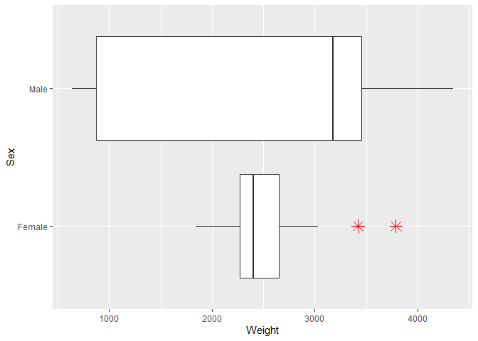
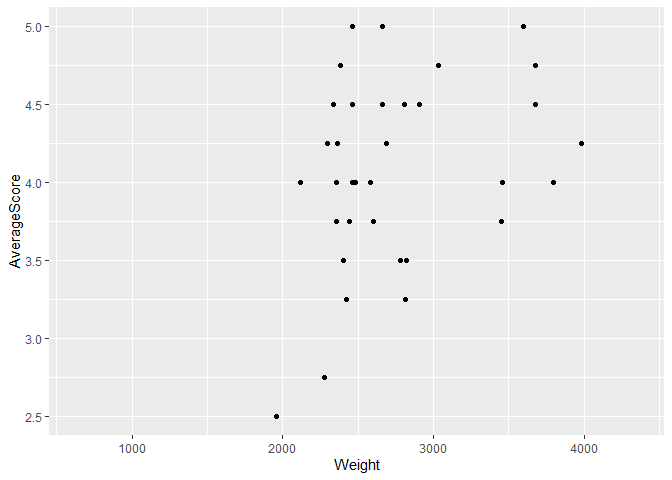

R Notebook for scorings
================

  - [Data extraction, transformation and
    loading](#data-extraction-transformation-and-loading)
      - [Packages loaded](#packages-loaded)
      - [Data loading](#data-loading)
  - [Visualization](#visualization)
      - [Weight boxplot](#weight-boxplot)
      - [Weight and scoring
        scatterplot](#weight-and-scoring-scatterplot)

This is an [R Markdown](http://rmarkdown.rstudio.com) Notebook. When you
execute code within the notebook, the results appear beneath the code.

Try executing this chunk by clicking the *Run* button within the chunk
or by placing your cursor inside it and pressing *Ctrl+Shift+Enter*.

# Data extraction, transformation and loading

## Packages loaded

``` r
r = getOption("repos")
r["CRAN"] = "http://cran.us.r-project.org"
options(repos = r)

#data loading
if (!require("readr")) {
  install.packages("readr", dependencies = TRUE)
  library(readr)
  citation("readr")
}
```

    ## Loading required package: readr

``` r
#data manipulation
if (!require("dplyr")) {
  install.packages("dplyr", dependencies = TRUE)
  library(dplyr)
  citation("dplyr")
}
```

    ## Loading required package: dplyr

    ## 
    ## Attaching package: 'dplyr'

    ## The following objects are masked from 'package:stats':
    ## 
    ##     filter, lag

    ## The following objects are masked from 'package:base':
    ## 
    ##     intersect, setdiff, setequal, union

``` r
#data visualisation
if (!require("ggplot2")) {
  install.packages("ggplot2", dependencies = TRUE)
  library(ggplot2)
  citation("ggplot2")
}
```

    ## Loading required package: ggplot2

## Data loading

``` r
typeVars <- c("Feet", "Head", "Type","FeatherColor")
ScoringData <- 
  read_delim(
    "../Data/Scorings.csv",
    delim = ";",
    col_types = cols(
      Date = col_character(),
      Sex = col_character(),
      AnimalIdentifier = col_character(),
      Weight = col_integer(), 
      Color = col_character(), 
      Feet = col_integer(), 
      Head = col_integer(),
      Type = col_integer(), 
      FeatherColor = col_integer()
      )) %>%
  dplyr::mutate(
    AverageScore = rowMeans(select(., typeVars))
    )
```

# Visualization

## Weight boxplot

``` r
library(ggplot2)
# Basic box plot
p <- ggplot(ScoringData, aes(x=Sex, y=Weight)) + 
  geom_boxplot(outlier.colour="red", outlier.shape=8,
                outlier.size=4)
p + coord_flip()
```

<!-- -->

## Weight and scoring scatterplot

``` r
# Basic box plot
p <- ggplot(ScoringData, aes(x=Weight, y=AverageScore)) + 
  geom_point()
p
```

    ## Warning: Removed 65 rows containing missing values (geom_point).

<!-- -->
