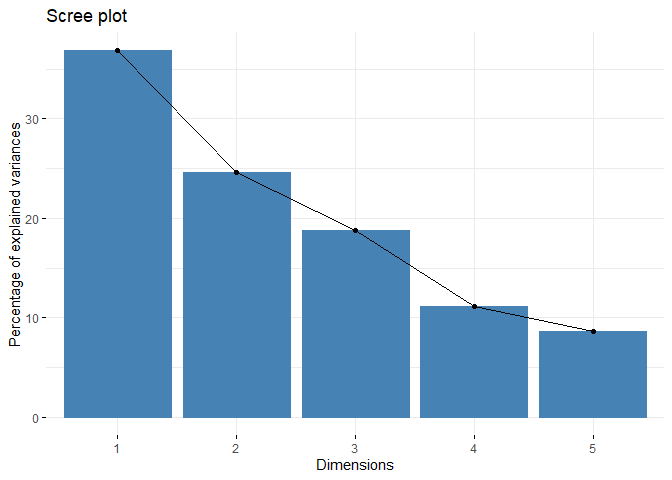
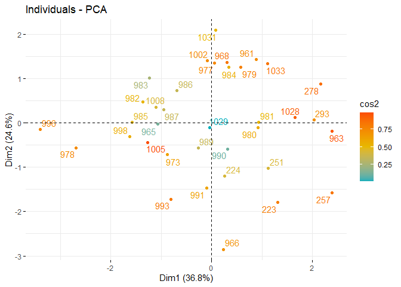
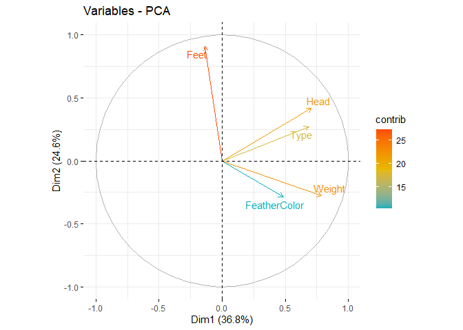
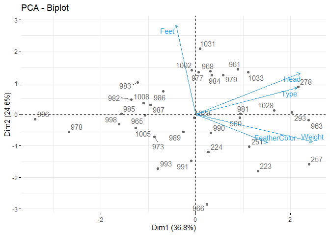

R Notebook for PCA scorings
================

  - [Data extraction, transformation and
    loading](#data-extraction-transformation-and-loading)
      - [Packages loaded](#packages-loaded)
      - [Data loading](#data-loading)
  - [PCA](#pca)
  - [Visuals](#visuals)
      - [Vizualize eigenvalues (scree
        plot)](#vizualize-eigenvalues-scree-plot)
      - [Graph of individual chicken](#graph-of-individual-chicken)
      - [Graph of variables.](#graph-of-variables.)
      - [Biplot of individuals and
        variables](#biplot-of-individuals-and-variables)

# Data extraction, transformation and loading

## Packages loaded

``` r
r = getOption("repos")
r["CRAN"] = "http://cran.us.r-project.org"
options(repos = r)

#data loading
if (!require("readr")) {
  install.packages("readr", dependencies = FALSE)
  library(readr)

}
```

    ## Loading required package: readr

``` r
citation("readr")
```

    ## 
    ## To cite package 'readr' in publications use:
    ## 
    ##   Hadley Wickham, Jim Hester and Romain Francois (2018). readr: Read
    ##   Rectangular Text Data. R package version 1.3.1.
    ##   https://CRAN.R-project.org/package=readr
    ## 
    ## A BibTeX entry for LaTeX users is
    ## 
    ##   @Manual{,
    ##     title = {readr: Read Rectangular Text Data},
    ##     author = {Hadley Wickham and Jim Hester and Romain Francois},
    ##     year = {2018},
    ##     note = {R package version 1.3.1},
    ##     url = {https://CRAN.R-project.org/package=readr},
    ##   }

``` r
#data manipulation
if (!require("dplyr")) {
  install.packages("dplyr", dependencies = TRUE)
  library(dplyr)
  
}
```

    ## Loading required package: dplyr

    ## 
    ## Attaching package: 'dplyr'

    ## The following objects are masked from 'package:stats':
    ## 
    ##     filter, lag

    ## The following objects are masked from 'package:base':
    ## 
    ##     intersect, setdiff, setequal, union

``` r
citation("dplyr")
```

    ## 
    ## To cite package 'dplyr' in publications use:
    ## 
    ##   Hadley Wickham, Romain François, Lionel Henry and Kirill Müller
    ##   (2020). dplyr: A Grammar of Data Manipulation. R package version
    ##   1.0.2. https://CRAN.R-project.org/package=dplyr
    ## 
    ## A BibTeX entry for LaTeX users is
    ## 
    ##   @Manual{,
    ##     title = {dplyr: A Grammar of Data Manipulation},
    ##     author = {Hadley Wickham and Romain François and Lionel {
    ##              Henry} and Kirill Müller},
    ##     year = {2020},
    ##     note = {R package version 1.0.2},
    ##     url = {https://CRAN.R-project.org/package=dplyr},
    ##   }

``` r
#data visualisation
if (!require("ggplot2")) {
  install.packages("ggplot2", dependencies = TRUE)
  library(ggplot2)
 
}
```

    ## Loading required package: ggplot2

``` r
citation("ggplot2")
```

    ## 
    ## To cite ggplot2 in publications, please use:
    ## 
    ##   H. Wickham. ggplot2: Elegant Graphics for Data Analysis.
    ##   Springer-Verlag New York, 2016.
    ## 
    ## A BibTeX entry for LaTeX users is
    ## 
    ##   @Book{,
    ##     author = {Hadley Wickham},
    ##     title = {ggplot2: Elegant Graphics for Data Analysis},
    ##     publisher = {Springer-Verlag New York},
    ##     year = {2016},
    ##     isbn = {978-3-319-24277-4},
    ##     url = {https://ggplot2.tidyverse.org},
    ##   }

``` r
#visuals for pca
if (!require("factoextra")) {
  install.packages("factoextra", dependencies = TRUE)
  library(factoextra)
  
}
```

    ## Loading required package: factoextra

    ## Welcome! Want to learn more? See two factoextra-related books at https://goo.gl/ve3WBa

``` r
citation("factoextra")
```

    ## 
    ## To cite package 'factoextra' in publications use:
    ## 
    ##   Alboukadel Kassambara and Fabian Mundt (2020). factoextra: Extract
    ##   and Visualize the Results of Multivariate Data Analyses. R package
    ##   version 1.0.7. https://CRAN.R-project.org/package=factoextra
    ## 
    ## A BibTeX entry for LaTeX users is
    ## 
    ##   @Manual{,
    ##     title = {factoextra: Extract and Visualize the Results of Multivariate Data Analyses},
    ##     author = {Alboukadel Kassambara and Fabian Mundt},
    ##     year = {2020},
    ##     note = {R package version 1.0.7},
    ##     url = {https://CRAN.R-project.org/package=factoextra},
    ##   }

``` r
#visuals for columntorownames
if (!require("tidyverse")) {
  install.packages("tidyverse", dependencies = TRUE)
  library(tidyverse)
}
```

    ## Loading required package: tidyverse

    ## -- Attaching packages -------------------------------------------------- tidyverse 1.3.0 --

    ## v tibble  3.0.3     v stringr 1.4.0
    ## v tidyr   1.1.2     v forcats 0.5.0
    ## v purrr   0.3.4

    ## -- Conflicts ----------------------------------------------------- tidyverse_conflicts() --
    ## x dplyr::filter() masks stats::filter()
    ## x dplyr::lag()    masks stats::lag()

``` r
citation("tidyverse")
```

    ## 
    ##   Wickham et al., (2019). Welcome to the tidyverse. Journal of Open
    ##   Source Software, 4(43), 1686, https://doi.org/10.21105/joss.01686
    ## 
    ## A BibTeX entry for LaTeX users is
    ## 
    ##   @Article{,
    ##     title = {Welcome to the {tidyverse}},
    ##     author = {Hadley Wickham and Mara Averick and Jennifer Bryan and Winston Chang and Lucy D'Agostino McGowan and Romain François and Garrett Grolemund and Alex Hayes and Lionel Henry and Jim Hester and Max Kuhn and Thomas Lin Pedersen and Evan Miller and Stephan Milton Bache and Kirill Müller and Jeroen Ooms and David Robinson and Dana Paige Seidel and Vitalie Spinu and Kohske Takahashi and Davis Vaughan and Claus Wilke and Kara Woo and Hiroaki Yutani},
    ##     year = {2019},
    ##     journal = {Journal of Open Source Software},
    ##     volume = {4},
    ##     number = {43},
    ##     pages = {1686},
    ##     doi = {10.21105/joss.01686},
    ##   }

``` r
#visuals for columntorownames
if (!require("tidyr")) {
  install.packages("tidyr", dependencies = TRUE)
  library(tidyr)
}
citation("tidyr")
```

    ## 
    ## To cite package 'tidyr' in publications use:
    ## 
    ##   Hadley Wickham (2020). tidyr: Tidy Messy Data. R package version
    ##   1.1.2. https://CRAN.R-project.org/package=tidyr
    ## 
    ## A BibTeX entry for LaTeX users is
    ## 
    ##   @Manual{,
    ##     title = {tidyr: Tidy Messy Data},
    ##     author = {Hadley Wickham},
    ##     year = {2020},
    ##     note = {R package version 1.1.2},
    ##     url = {https://CRAN.R-project.org/package=tidyr},
    ##   }

## Data loading

``` r
typeVars <- c("Feet", "Head", "Type","FeatherColor")
ScoringData <- 
  read_delim(
    "../Data/Scorings.csv",
    delim = ";",
    col_types = cols(
      Date = col_character(),
      Sex = col_character(),
      AnimalIdentifier = col_character(),
      Weight = col_integer(), 
      Color = col_character(), 
      Feet = col_integer(), 
      Head = col_integer(),
      Type = col_integer(), 
      FeatherColor = col_integer()
      )) %>%
  dplyr::mutate(
    AverageScore = rowMeans(select(., typeVars))
    ) %>% drop_na() %>%
  dplyr::select(
    AnimalIdentifier,
    Weight,
    Feet, 
    Head,
    Type,
    FeatherColor
  ) %>% column_to_rownames(
    var = "AnimalIdentifier")
```

    ## Note: Using an external vector in selections is ambiguous.
    ## i Use `all_of(typeVars)` instead of `typeVars` to silence this message.
    ## i See <https://tidyselect.r-lib.org/reference/faq-external-vector.html>.
    ## This message is displayed once per session.

# PCA

``` r
pcaScores <- prcomp(ScoringData, scale=TRUE)
```

# Visuals

## Vizualize eigenvalues (scree plot)

Show the percentage of variances explained by each principal component.

``` r
fviz_eig(pcaScores)
```

<!-- -->

## Graph of individual chicken

Individuals with a similar profile are grouped together.

``` r
fviz_pca_ind(pcaScores,
             col.ind = "cos2", # Color by the quality of representation
             gradient.cols = c("#00AFBB", "#E7B800", "#FC4E07"),
             repel = TRUE     # Avoid text overlapping
             )
```

<!-- -->

## Graph of variables.

Positive correlated variables point to the same side of the plot.
Negative correlated variables point to opposite sides of the graph.

``` r
fviz_pca_var(pcaScores,
             col.var = "contrib", # Color by contributions to the PC
             gradient.cols = c("#00AFBB", "#E7B800", "#FC4E07"),
             repel = TRUE     # Avoid text overlapping
             )
```

<!-- -->

## Biplot of individuals and variables

``` r
fviz_pca_biplot(pcaScores, repel = TRUE,
                col.var = "#2E9FDF", # Variables color
                col.ind = "#696969"  # Individuals color
                )
```

<!-- -->
