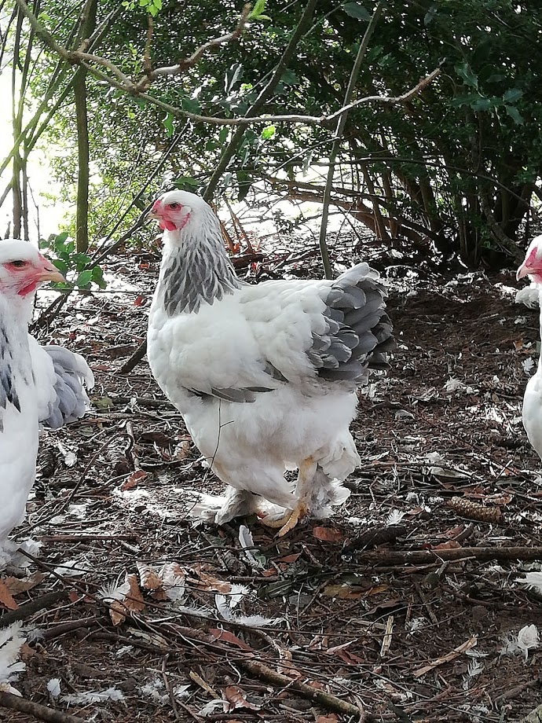
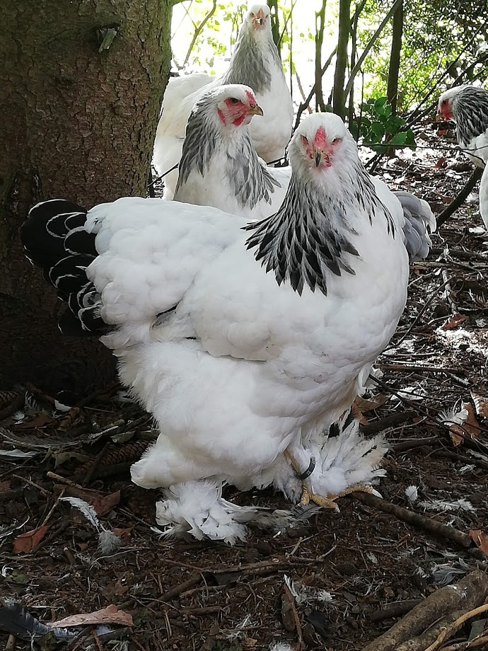
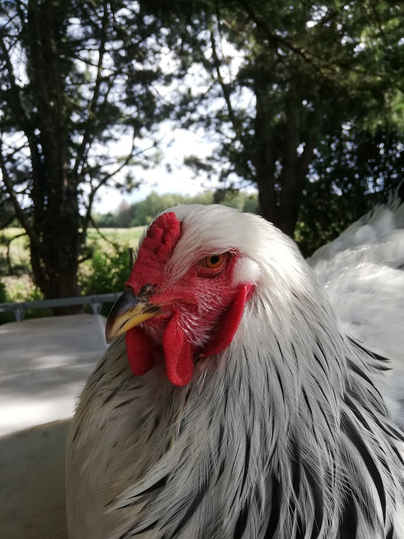
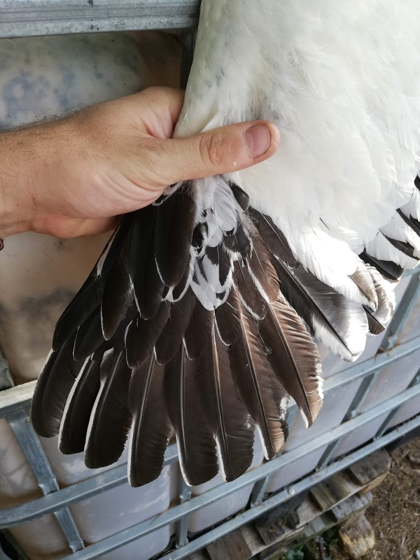

Notebook for Brahma Scoring
================

  - [The dataset](#the-dataset)
      - [Blue Light Brahma](#blue-light-brahma)
      - [Black Light Brahma](#black-light-brahma)
  - [Scorings (or features)](#scorings-or-features)
      - [Weights](#weights)
      - [Scoring](#scoring)

This is an [R Markdown](http://rmarkdown.rstudio.com) Notebook. When you
execute code within the notebook, the results appear beneath the code.

# The dataset

The Brahma is one of the largest chicken in the world.

We have different colors, of which the light version have been scored in
this dataset.

## Blue Light Brahma

## Black Light Brahma

This dataset contains type scoring from Brahma Chicken.

  - Date - Date of the weighing/scoring
  - Sex - Gender of the animal
  - Animalidentifier - Identifier for the animal (its official tag)
  - Weight - Color (Blue Light Brahma or Black Light Brahma)
  - Feet - Scoring 1-5 (Higher is better)
  - Head - Scoring 1-5 (Higher is better)
  - Type - Scoring 1-5 (Higher is better)
  - FeatherColor - Scoring 1-5 (Higher is better)

# Scorings (or features)

## Weights

All animals were weight at each scoring, the weight is expressed in
grams.

A link to the weight distribution can be found here in
[R](R/MyFirstVisual.md), [python](Python/MyFirstVisual.ipynb) and
[tableau](https://public.tableau.com/profile/bovianalytics#!/vizhome/BrahmaScorings/Scatterplot)

## Scoring

The head of the brahma needs to wide and menacing

The color of the feather needs to like in the picture underneath

The feet need to have equal length in toes and yellow

The animals need to have a typical brahma type as shown in the pictures
above.
